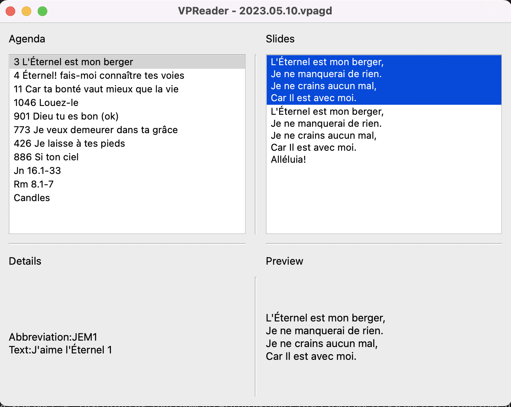

# VPReader
VideoPsalm© reader for mac

VPReader is a free reader for VideoPsalm© agenda (file .vpagd).

VPReader opens files generated by the Windows version of VideoPsalm©.

So, VPReader is not standalone application. Use  ".vpagd" examples files provided in dmg archive to test it.

If you are an user, see it as an extra solution in case you need to display VideoPsalm© agendas from a Mac.

If you are a developper, see it as a first step in the mac world for VideoPsalm©. Let me invit you to have a look at the functions in charge of reading of vpagd files, some information about [fileformat](vpagd_file_format.json) and thinks at others solutions than standalone application (i.e. web/mobile applications) to enhance VideoPsalm©, this great software !

VPReader rely on PySide, a free implementation of QT for Python: Be indulgent, I'm a beginner!

For now, I am releasing an Apple Silicon (aka m1/m2) version of VPReader.

## Features
  can then display agenda contents as well as contents of each song, biblical text and image.

Shortcuts : 
- ⌘, F ; ⌘, X ; ⌘, Q : As usual.
- ⌘, P : Toggle in [Fullscreen Mode](Fullscreen.png).
- Esc : Return to the main Window.

Multiple screens are not really supported, yet.
FullScreen view is actually **not** fullscreen, it's windowed. But, in case you have 2 screens, you can move the "fullscreen" window in the second screen and maximize it.

## Disclaimer
VideoPsalm© is a [licenced software] see https:/myvideopsalm.weebly.com/about.html.

VPReader is a [licensed software](LICENSE).

Warning: This open source software is designed to play files created by a copyrighted commercial application. Please note that use of this software may constitute copyright infringement, and the author of this software cannot be held responsible for any infringement of such rights. It is your responsibility to ensure that you have the necessary rights to read and use these files before using this software. Please also note that this software is provided "as is", without warranty of any kind, express or implied, including but not limited to the warranty of merchantability, fitness for a particular purpose and non-infringement. By using this software, you agree to do so at your own risk.
